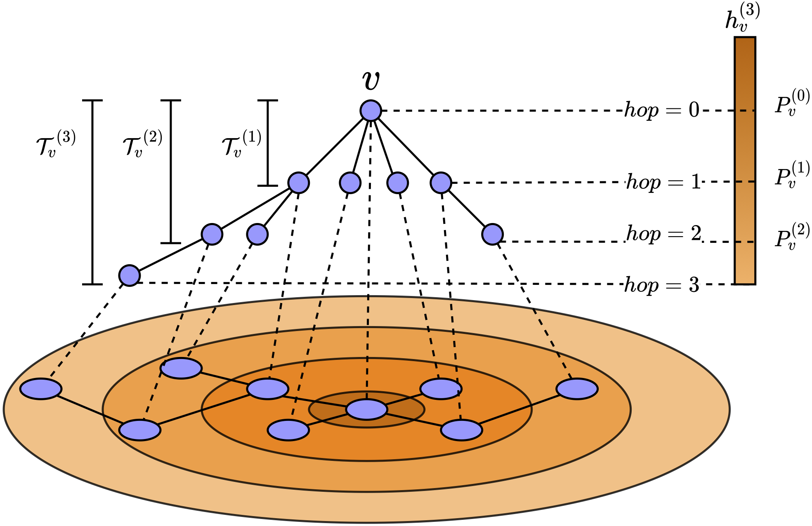

# Ordered GNN

The official implementation of the paper "Ordered GNN: Ordering Message Passing to Deal with Heterophily and Over-smoothing" ([ICLR 2023](https://openreview.net/forum?id=wKPmPBHSnT6)).

<p align="middle">

</p>

## Dependencies

This is the list of the package versions required for our experiments.

```txt
python==3.8.12
torch==1.11.0
torch_geometric==2.0.4
torch_sparse==0.6.13
torch_scatter==2.0.9
torch_cluster==1.6.0
torch_spline_conv==1.2.1
wandb==0.12.16
```

## Run

We manage our experiments with [wandb](https://wandb.ai), to reproduce the results we reported in our paper, please follow these steps:

- Set up the environment variables. Below 2 environment variables `$YOUR_WANDB_ENTITY$` and `$YOUR_WANDB_PROJECT$` are your wandb username and the name of the project.

    ```bash
    export WANDB_entity=$YOUR_WANDB_ENTITY$
    export WANDB_project=$YOUR_WANDB_PROJECT$
    ```

- Choose best hyper-parameters you want to run with, and create wandb sweep with that file.
    
    We record the best hyper-parameters in folder `best_params`, you can index corresponding file by name. For example, `over-smoothing_Cora_OrderedGNN_4.yaml` stores hyper-parameters for experiment on over-smoothing problem on Cora dataset, with a 4 layers Ordered GNN model.

    ```bash
    python sweep.py --sweep_file=best_params/over-smoothing_Cora_OrderedGNN_4.yaml
    ```

- You will get an sweep ID `$SWEEP_ID$` and sweep URL `$SWEEP_URL$` from last step, like:

    ```bash
    Create sweep with ID: $SWEEP_ID$
    Sweep URL: $SWEEP_URL$
    ```

    then run below command will start runs with GPU. Parameter `$INDEX_GPU$:$PARALLEL_RUNS$` indicate we will run `$PARALLEL_RUNS$` runs in parallel with GPU `$INDEX_GPU$`.

    ```bash
    python agents.py --sweep_id=$SWEEP_ID$ --gpu_allocate=$INDEX_GPU$:$PARALLEL_RUNS$
    ```

- You can check the results in `$SWEEP_URL$`, a website hosted on [wandb.ai](https://wandb.ai).

## Citation

If you found the provided code with our paper useful in your work, we kindly request that you cite our work. 

```BibTex
@inproceedings{song2023ordered,
    title={Ordered GNN: Ordering Message Passing to Deal with Heterophily and Over-smoothing},
    author={Yunchong Song and Chenghu Zhou and Xinbing Wang and Zhouhan Lin},
    booktitle={The Eleventh International Conference on Learning Representations},
    year={2023}
}
```
